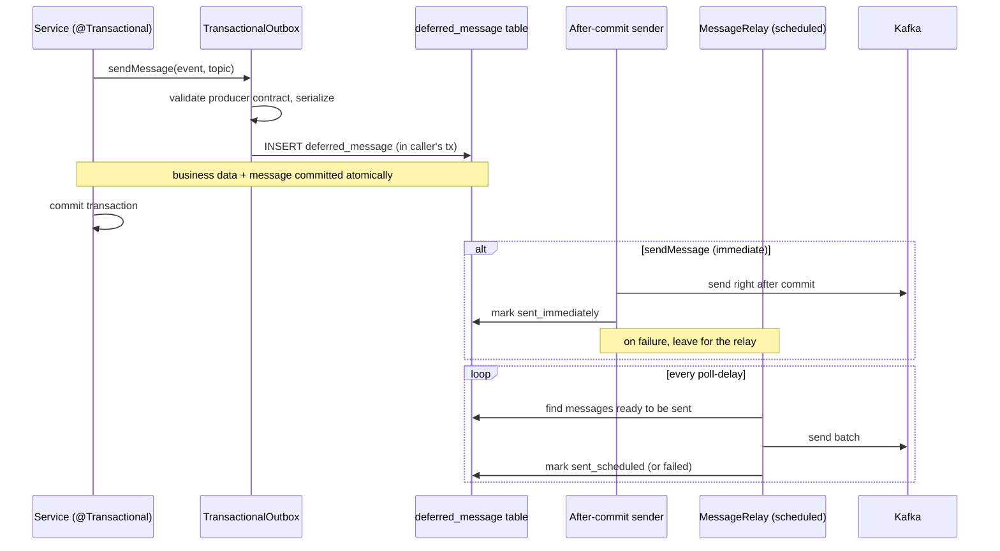

# Architecture

The transactional outbox decouples *queuing* a message from *delivering* it. Queuing happens inside
the caller's database transaction; delivery happens afterwards, either immediately after commit or by
a background relay.

## Building blocks

| Component                       | Responsibility                                                                                  |
|---------------------------------|-------------------------------------------------------------------------------------------------|
| `TransactionalOutbox`           | Public API. Validates the producer contract, serializes the message, persists a `DeferredMessage` |
| `DeferredMessage`               | JPA entity stored in the `deferred_message` table (serialized message bytes, topic, state, trace context) |
| `AfterCommitMessageSender`      | Sends immediately-flagged messages once the transaction commits (`TxSyncAfterCommitMessageSender`) |
| `MessageRelay`                  | Polls the table for messages ready to be sent and relays them in batches                        |
| `MessageRelayScheduler`         | Triggers `MessageRelay.relay()` on a fixed delay, guarded by a ShedLock lock                    |
| `KafkaDeferredMessageSender`    | Sends the stored bytes to Kafka using dedicated byte-array `KafkaTemplate`s                     |
| `OutboxHouseKeeping`            | Deletes sent/unsent messages past their retention                                               |
| `MicrometerOutboxMetrics`       | Records gauges, counters and timers (when a `MeterRegistry` is present)                          |

Messages are stored as already-serialized Avro Kafka bytes. This means the relay can deliver a
message even on an instance that does not have the message type's Java binding on its classpath.

## Send flow

## Immediate vs. scheduled delivery

- **Immediate** (`sendMessage`): the message is sent in the caller's thread right after commit, via a
  transaction synchronization (`TxSyncAfterCommitMessageSender`). Lowest latency, scales horizontally
  with application instances. If the immediate send fails, the message stays in the table and the
  relay picks it up later — so a relay must always be running as a fallback.
- **Scheduled** (`sendMessageScheduled`): the message is only persisted; a background relay delivers
  it later. Frees the request thread, but adds latency and is serial (one relay sends at a time).

See [Sending messages](sending-messages.md) for the trade-offs and the API.

## The relay process

`MessageRelay.relay()` repeatedly fetches a batch (`message-relay-batch-size`) of messages ready to be
sent and delivers them in insertion order, stopping when the table is empty or `continuous-relay-timeout`
is reached. A relay runs automatically on every instance of a service that includes the outbox, but
only one relay sends at a time: `MessageRelayScheduler` holds a ShedLock lock
(`outbox-message-relay-tasks`) so parallel instances do not relay simultaneously. If the holding
instance dies, another takes over once the lock expires. The relay can be disabled with
`scheduled-relay-enabled=false` (for example to run dedicated relay instances).

## Related

- [Sending messages](sending-messages.md)
- [Failure handling](failure-handling.md)
- [Multi-cluster support](multi-cluster.md)
- [Metrics](metrics.md)
- [jeap-messaging-outbox](../README.md)
